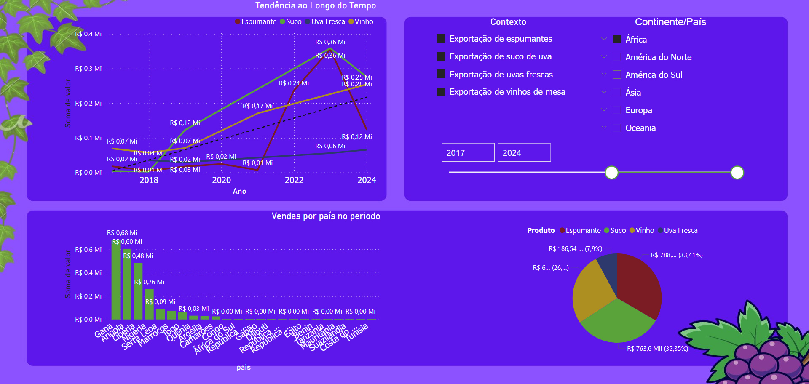

# 🍇 Vitibrasil Analytics – Scrapper e Padronização de Dados de Exportação de Vinhos

<p align="center">
  
  
</p>

## 1. 🎯 Visão Geral do Projeto

Este repositório reúne soluções voltadas à análise de dados sobre a **exportação de vinhos brasileiros** entre 2008 e 2023, utilizando técnicas de **web scraping e padronização textual**:

- 📦 **Scraper automatizado** de dados públicos da Embrapa (Vitibrasil)
- 🧽 **Pipeline de limpeza e padronização de nomes de países** usando fuzzy matching

Acesse diretamente no Colab: [🔗 <a href='https://colab.research.google.com/drive/1PKCWksufdFb1y_1ytx8VvKY_l46kS-71?usp=sharing'> Script no Google Colab</a>]

Após o scrapping também foi feito um pequeno enriquecimento utilizando de SQL(foi utilizado para EDA, deixarei o script também) 
para fins de adição de uma coluna com alguns outros dados como "Continente", para fim de concepção de um dashboard,
como você pode ver abaixo, mostrando tendências iniciais que podem ser extraídas dos nossos dados.



Acesse diretamente no PowerBI: [🔗 <a href='https://app.powerbi.com/view?r=eyJrIjoiNTM1NGUyNTYtYThjZS00NjcwLTgzZTEtZGQ0M2VjMTU5NGRiIiwidCI6IjMyNDFkMzllLTdiZDEtNDQ2My05ZGFmLWU2M2M2MWZjOWRkYyJ9'> Dashboard</a>]

---

## 2. 🛠️ Tecnologias Utilizadas

- `MSSQL`
- `Python 3.10+`
- `pandas` – Manipulação de dados
- `requests` – Requisições HTTP
- `BeautifulSoup (bs4)` – Extração de tabelas HTML
- `fuzzywuzzy` + `python-Levenshtein` – Fuzzy matching
- `unidecode` – Normalização textual
- `os`, `pathlib`, `time` – Gerenciamento de diretórios e controle de execução

---

## 3. 📌 Funcionalidades

| Módulo                      | Descrição                                                                 |
|----------------------------|---------------------------------------------------------------------------|
| `scraper`    | Coleta dados de exportação por ano e categoria diretamente do site da Embrapa |
| `fuzzy com normalização`           | Padroniza nomes de países com fuzzy matching e correções manuais |
| `notebook.ipynb`           | Pipeline completo com scraping, tratamento e exportação final dos dados |

---

## 4. ⚙️ Como Executar

Baixe o arquivo e importe no google Colab, após isso é só executar todas as células e aguardar a mágica 😎

Os arquivos serão salvos no diretório `data/raw`.

### ✨ Padronização com Fuzzy Matching

```python
from fuzzy_match import fuzzy_match_dataframe

correcoes = {"Eslovaca, Republica": "Eslováquia"}
excluir = ["Total", "Outros", "Desconhecido"]

df_corrigido = fuzzy_match_dataframe(
    df_exportacao,
    df_paises_referencia,
    coluna_origem="País",
    coluna_referencia="País",
    threshold=85,
    correcoes_manuais=correcoes,
    excluir_valores=excluir
)
```

---

## 5. 📊 Por Que Padronizar os Países?

Durante o scraping, diversos nomes de países são coletados com **variações ortográficas ou políticas**. Exemplos:

- `Austrália` vs `Australia`
- `Coreia do Sul, Republica da` vs `Coreia do Sul`

Essas variações impactam análises e visualizações. O fuzzy matching identifica e corrige inconsistências, utilizando:

- 🧠 Correções manuais
- 🚫 Exclusões explícitas
- 🔤 Normalização com `unidecode` e `lower()`

---

## 6. 💾 Saída Esperada

| Arquivo                        | Descrição                                     |
|-------------------------------|-----------------------------------------------|
| `exportacao_2008_2023.csv`    | Dados brutos consolidados da Embrapa          |
| `exportacao_corrigida.csv`    | Dados com nomes de países padronizados        |
| Outros `.csv`                 | `producao_2008_2023.csv`, `importacao_...` etc.|

Cada dataset possui colunas padronizadas como: `País`, `Quantidade`, `Valor`, `Ano`.

---

## 7. 📎 Boas Práticas Implementadas

- `sleep(2)` para evitar sobrecarga no servidor da Embrapa
- Tolerância a falhas: arquivos são salvos mesmo com erros parciais
- Estrutura modular para facilitar manutenção e expansão
- Nomeação clara de arquivos para uso em BI

---

## 8. 📢 Créditos

Este projeto foi desenvolvido como parte do Tech Challenge da FIAP, utilizando dados públicos da **Embrapa** bem como de dados fornecidos pelo **GOV** e pelo **IBGE**, com inspiração em práticas reais de **Data Analytics**.
